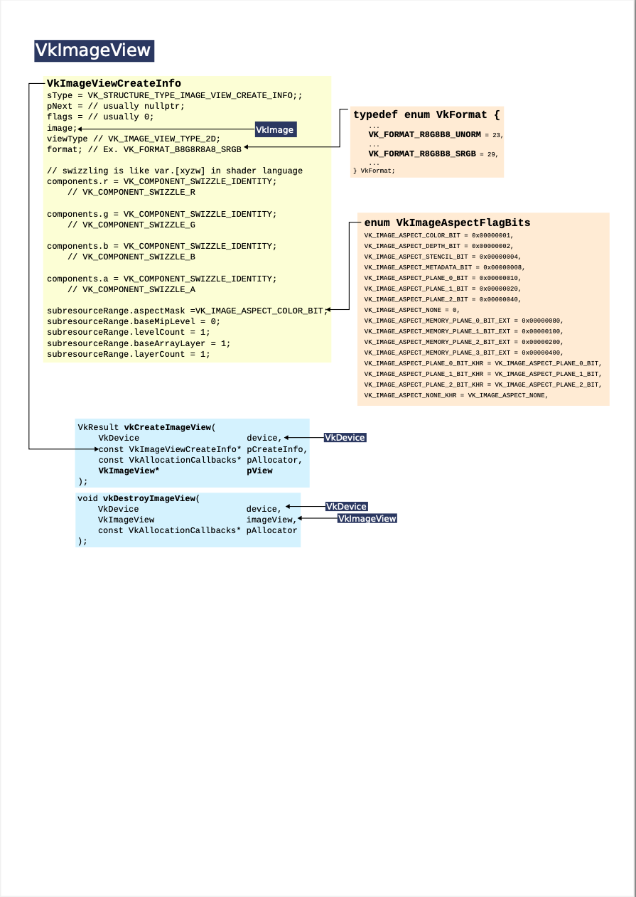
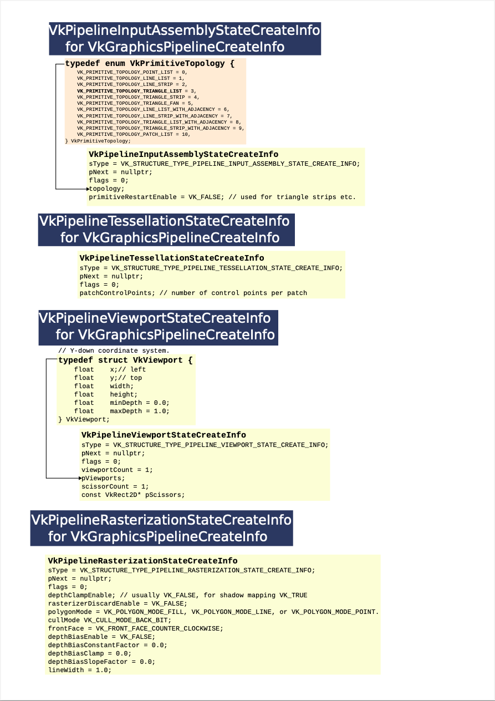

# VulkanDiagram
Visual study aid to help build mental map of the Vulkan structures, functions, and enums.

[Vulkan](https://www.vulkan.org/) is a clean GPU API in C, but it has many functions, structures, and enums, whose dependencies are intricately interconnected.
Unless you are a prodigy with some photographic memory, it is difficult to keep track of all the necessary elements in the brain.
This set of diagrams is intended to be a visual aid to grasp the intricacy and interconnectivity of the Vulkan API easily.
This is by no means comprehensive, and I'm still learning, but it covers the basic elements for rendering.

All the pages in a single PDF file is found in [vulkan_diagrams.pdf](vulkan_diagrams.pdf).

## Overview
An overview of some important elements and their interdependencies for very basic rendering.

## GLFW
GLFW is not part of Vulkan, but it is frequently used in samples & tutorials.
It is good to know how Vulkan interacts with the window management.

## VkInstance

## VkSurface
For Xwindow systems.

## VkPhysicalDevice, VkExtensionProperties, VkSurfaceCapabilitiesKHR, VkSurfaceFormatKHR, & VkPresentModeKHR
With some sample outputs from a computer with NVIDIA Geforce RTX 3060 8GB.

## VkPhysicalDeviceProperties & VkPhysicalDeviceFeatures
With some sample outputs from NVIDIA Geforce RTX 3060 8GB.

## VkPhysicalDeviceMemoryProperties
With some sample outputs from NVIDIA Geforce RTX 3060 8GB.

## VkDevice & VkQueue
With some sample outputs for VkQueueFamilyProperties from NVIDIA Geforce RTX 3060 8GB.

## vkGetPhysicalDeviceSurfaceSupportKHR(), vkGetPhysicalDeviceSurfaceCapabilitiesKHR(), vkGetPhysicalDeviceSurfacePresentModesKHR(), and vkGetPhysicalDeviceSurfaceFormatsKHR() for VkSwapchainKHR

## VkSwapchainKHR

## VkSubpassDescription & VkSubpassDependency for VkRenderPass

## VkAttachmentDescription & VkRenderPass

## VkDeviceMemory

## VkBuffer

## VkSampler

## VkImage

## VkImageView

## VkFramebuffer

## VkCommandPool & VkCommandBuffer

## VkDescriptorSetLayout

## VkDescriptorPool

## VkDescriptorSet

## VkSemaphore & VkFence

## VkPipelineLayout for VkGraphicsPipelineCreateInfo & vkCmdBindDescriptorSets()

## VkPipelineShaderStageCreateInfo & VkPipelineVertexInputStateCreateInfo for VkGraphicsPipelineCreateInfo

## VkPipelineInputAssemblyStateCreateInfo, VkPipelineTessellationStateCreateInfo, VkPipelineViewportStateCreateInfo, and VkPipelineRasterizationStateCreateInfo for VkGraphicsPipelineCreateInfo

## VkPipelineMultisampleStateCreateInfo & VkPipelineDepthStencilStateCreateInfo for VkGraphicsPipelineCreateInfo

## VkPipelineColorBlendStateCreateInfo & VkPipelineDynamicStateCreateInfo for VkGraphicsPipelineCreateInfo

## VkPipeline

## Outermost Loop per Frame

## Mid Loop per CommandBuffer

## Innermost Loop per RenderPass
Actually it consits of further two leavels: Outer per Renderpass, and Inner per Pipeline(subpass).

## VkCommandBuffer for a One-Time Command

## One-Time Command for Copying with vkCmdCopyBuffer(), vkCmdCopyBufferToImage(), vkCmdCopyBufferToImage(), and vkCmdBlitImage()

## MemoryBarrier

